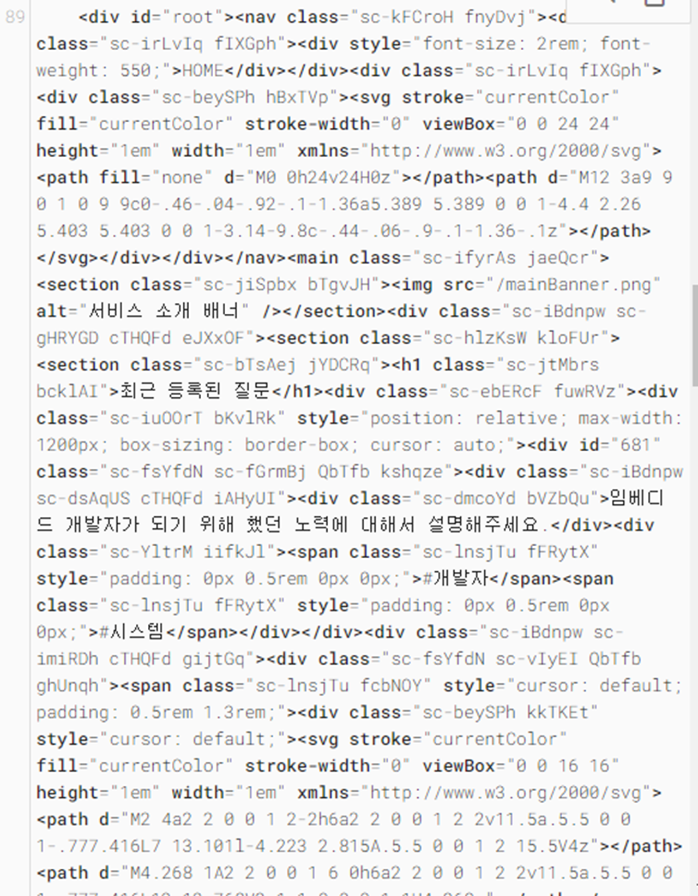

**프로젝트 예상 시작 시간은 vanilla-renderer구현을 완료하고 시작될 예정입니다.**

# 목적

본 프로젝트는 웹 크롤러를 직접 구현하기 위한 목적으로 제작되었습니다.

# WHY?

지난 [프로젝트 키윙](https://github.com/Team-kiwing/Team-3seco-kiwing-fe)을 진행하며 기술스택을 결정하는 단계에서 오직 **SEO** 때문에 SSR을 고민했고 SSR 때문에 Next.js 도입을 고민했습니다.

하지만 그런 고민을 하다보니 개인적인 궁금증이 하나 생겼습니다. 
**`"구글 크롤링 봇은 웹 사이트의 js를 실행하지 못하는 것일까?"`**

왜 사람들은 Next를 쓸까요? 보통 주변에서 이유를 물어보면 SSR과 이미지 최적화를 주로 말합니다.
그런데, `왜 SSR이 SEO최적화가 좋은지?` `왜 기존 SSR방식에서 CSR이라는 방식이 나왔다가 다시 선회하였는지?`를 질문하면 답변을 어려워합니다.

저 역시도 그저 그렇게 생각을 하던 사람 중 한명이였습니다. 그런데 지난 프로젝트를 하면서 의문점이 생겼습니다. 저희 프로젝트는 React와 CSR + SPA 형태의 프로젝트였습니다.

일반적으로 아는 사실대로라면 빈 html이 수집되어야 할 것 입니다. 그런데 크롤러봇이 수집한 페이지에서는
정말 놀랍게도 그렇지 않았습니다.

크롤러 봇이 js를 실행된 이후의 파일을 크롤링하고 있었습니다.

크롤러 봇이 js를 실행시킨다는 것이 진짜일까요? 아니면 우연히 저런 결과가 나온걸까요? 크롤러 봇이 궁금해졌고 크롤링을 어떻게 진행하는 지 원리가 궁금해졌습니다.

이 이유가 본 프로젝트가 만들어진 계기입니다. 본 프로젝트에서 크롤러를 직접 만드려고 합니다. cheerio라는 유명한 라이브러리가 있지만 단순 HTML 파싱이 아닌 실제 브라우저 환경에서 동작하는 웹 크롤러를 제작해야하기 때문에 크롬 브라우저를 headless 모드로 사용하게 해주는 Puppeteer으로 제작을 진행할 예정입니다.
또한 Puppeteer로도 부족하다면 cheerio로도 같이 만들 예정입니다.

아쉽게도 구글 크롤링 봇은 어떻게 구현되었는지 어떤 코드로 작성되었는지 대외적으로 공개된 적이 없습니다. 하지만 이번 프로젝트를 통해 어떤 방식으로 진행되는지 인사이트를 얻을 수 있을 것으로 기대합니다.
